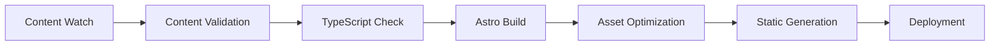

# CV-Mathieu-Drouet-2025 - Project Documentation

## Table of Contents

1. [Project Overview](#project-overview)
2. [Architecture Overview](#architecture-overview)
3. [Project Structure](#project-structure)
4. [Component System](#component-system)
5. [Content Management](#content-management)
6. [Build System](#build-system)
7. [Development Workflow](#development-workflow)
8. [Configuration Management](#configuration-management)
9. [Styling System](#styling-system)
10. [Icon System](#icon-system)
11. [Performance & Security](#performance--security)
12. [Deployment](#deployment)

---

## Project Overview

**cv-mathieudrouet-2025** is a modern, performance-optimized personal CV/resume website built with Astro v5.13.5, TypeScript, and Tailwind CSS v4. The project showcases professional experience and skills through a sophisticated content management system and responsive design.

### Key Features

- **Astro Framework**: Static site generation with modern JavaScript
- **TypeScript**: Type-safe development environment
- **Tailwind CSS v4**: Modern utility-first styling with PostCSS plugin
- **Content Collections**: Structured content management with Zod validation
- **Icon Engine**: Dynamic icon system supporting multiple icon sets
- **Performance Optimized**: Code splitting, asset optimization, and caching strategies
- **Accessibility**: WCAG-compliant design with semantic markup
- **Multi-theme Support**: Lumon design system with theme variations

### Technical Stack

```json
{
  "framework": "Astro 5.13.5",
  "language": "TypeScript 5.7.3",
  "styling": "Tailwind CSS 4.1.11",
  "icons": "Iconify + unplugin-icons",
  "testing": "Vitest 3.2.4",
  "deployment": "Netlify (cv.drouet.io)"
}
```

---

## Architecture Overview

### System Architecture

```
┌─────────────────────────────────────────────────────────┐
│                    Astro Framework                      │
├─────────────────────────────────────────────────────────┤
│  Pages          │  Layouts        │  Components         │
│  ├─ index.astro │  └─ BaseLayout  │  ├─ CV Components   │
│  └─ about.astro │     .astro      │  ├─ Experience Card │
│                 │                 │  └─ Contact Modal   │
├─────────────────────────────────────────────────────────┤
│              Content Management Layer                   │
│  ├─ Content Collections (Astro)                        │
│  ├─ CV Parser (TypeScript)                             │
│  ├─ Icon Engine (TypeScript)                           │
│  └─ Content Watcher (Node.js)                          │
├─────────────────────────────────────────────────────────┤
│                  Styling System                         │
│  ├─ Tailwind CSS v4 (PostCSS)                          │
│  ├─ Lumon Design System                                 │
│  ├─ Typography System                                   │
│  └─ Responsive Breakpoints                              │
├─────────────────────────────────────────────────────────┤
│                Build & Deployment                       │
│  ├─ Vite (Bundling & Optimization)                     │
│  ├─ TypeScript (Type Checking)                         │
│  ├─ Vitest (Testing)                                   │
│  └─ Netlify (Hosting)                                  │
└─────────────────────────────────────────────────────────┘
```

### Data Flow Architecture

1. **Content Source**: Markdown files in `src/content/`
2. **Content Processing**: CV Parser extracts structured data
3. **Icon Processing**: Icon Engine resolves and renders icons
4. **Component Rendering**: Astro components consume structured data
5. **Static Generation**: Build process creates optimized static files
6. **Deployment**: Netlify serves static files with CDN

---

## Project Structure

```
cv-mathieudrouet-2025/
├── src/
│   ├── components/           # Reusable UI components
│   │   ├── cv/              # CV-specific components
│   │   │   ├── CVCard.astro     # Card container component
│   │   │   ├── CVGrid.astro     # Grid layout component
│   │   │   └── CVSection.astro  # Section wrapper component
│   │   ├── icons/           # Icon components
│   │   │   └── CarbonIcon.astro # Carbon icon wrapper
│   │   ├── ContactModal.astro   # Contact form modal
│   │   └── ExperienceCard.astro # Experience/skill display
│   ├── config/              # Configuration modules
│   │   ├── env.ts          # Environment configuration
│   │   ├── images.ts       # Image configuration
│   │   └── site.ts         # Site-wide configuration
│   ├── content/            # Content collections
│   │   ├── cv/            # CV content
│   │   │   └── cv.md      # Main CV content file
│   │   ├── about/         # About page content
│   │   │   └── about.md   # About page content
│   │   └── config.ts      # Content collections schema
│   ├── layouts/           # Page layouts
│   │   └── BaseLayout.astro   # Base HTML layout
│   ├── pages/             # Route pages
│   │   ├── index.astro    # Home page (CV display)
│   │   └── about.astro    # About page
│   ├── styles/            # Global styles
│   │   └── global.css     # Tailwind imports and tokens
│   ├── types/             # TypeScript definitions
│   │   └── icons.ts       # Icon system types
│   └── utils/             # Utility modules
│       ├── cvParser.ts    # CV content parser
│       ├── debug.ts       # Debug utilities
│       └── iconEngine.ts  # Icon processing engine
├── scripts/               # Build and utility scripts
│   └── watch-content.js   # Content change detection
├── astro.config.mjs       # Astro configuration
├── tailwind.config.mjs    # Tailwind CSS configuration
├── package.json          # Dependencies and scripts
└── tsconfig.json         # TypeScript configuration
```

---

## Component System

### Component Hierarchy

```
BaseLayout (Root Layout)
├── Header (Auto-generated from CV data)
├── Main Content
│   ├── CVGrid (3-column responsive grid)
│   │   ├── CVCard (Education)
│   │   ├── CVCard (Contact)
│   │   └── CVCard (Interests)
│   ├── CVSection (Experience)
│   │   └── ExperienceCard (Multiple instances)
│   └── CVSection (Skills)
│       └── ExperienceCard (Multiple instances, 2-col grid)
├── Footer (Social links & actions)
└── ContactModal (Modal overlay)
```

### Key Components

#### 1. **BaseLayout.astro**
- **Purpose**: Root HTML structure with meta tags, fonts, and scripts
- **Features**: SEO optimization, accessibility, security headers, theme support
- **Props**: `title`, `description`, `showFooter`, `image`, `url`, `enableDebugMode`, `theme`

#### 2. **CVCard.astro** 
- **Purpose**: Card container for sidebar content (Education, Contact, Interests)
- **Features**: Icon support, responsive design, glass-morphism styling
- **Props**: `title`, `id`, `icon`

#### 3. **CVSection.astro**
- **Purpose**: Main section wrapper for Experience and Skills
- **Features**: Section headers with subtitles, structured layout
- **Props**: `title`, `subtitle`, `id`

#### 4. **ExperienceCard.astro**
- **Purpose**: Display experience entries and skill categories
- **Features**: Company logos, icons, achievement lists, responsive design
- **Props**: `company`, `companyUrl`, `role`, `period`, `current`, `logo`, `icon`, `levelIcon`

#### 5. **ContactModal.astro**
- **Purpose**: Modal overlay for contact functionality
- **Features**: Keyboard navigation, focus management, ARIA compliance

---

## Content Management

### Content Collections Schema

```typescript
// src/content/config.ts
const cvCollection = defineCollection({
  type: 'content',
  schema: z.object({
    name: z.string(),
    title: z.string().optional(),
    description: z.string().optional(),
    iconSet: z.enum(['carbon', 'tabler', 'lucide', 'heroicons', 'feather'])
      .optional().default('carbon'),
    theme: z.enum(['lumon', 'atari']).optional().default('lumon'),
  }),
});
```

### CV Parser System

The CV Parser (`src/utils/cvParser.ts`) is a sophisticated content extraction system that transforms markdown content into structured data.

#### Key Features

1. **Flexible Icon Support**: Supports multiple icon formats and sets
2. **Markdown Processing**: Converts markdown formatting to HTML
3. **Section Parsing**: Extracts structured data from predefined sections
4. **Error Handling**: Graceful fallbacks and comprehensive error handling
5. **Caching**: Efficient parsing with performance optimization

#### Supported Content Sections

```typescript
interface CVData {
  name: string;
  education: Education[];
  contact: Contact;
  contactContent?: string[];
  interests: string[];
  experience: Experience[];
  skills: Skill[];
  // Section icons
  educationIcon?: string;
  contactIcon?: string;
  interestsIcon?: string;
}
```

#### Content Format Example

```markdown
---
name: "Mathieu Drouet"
iconSet: "carbon"
theme: "lumon"
---

## **carbon:airline-passenger-care** Education

### Programmation iOS - SwiftUI
Simplon.co, Lille – 2022–2023

## **carbon:identification** Coordonnées

**carbon:email** **Email:** m@mdr.cool
**carbon:logo-linkedin** [**LinkedIn**](https://linkedin.com/in/mathieudrouet)

## Expériences

### Company Name
**carbon:location-heart-filled** Location – Year
**Role Title** | Period | [Company Link](url)

- Achievement with **carbon:icon-name** icon support
- **Bold text** and *italic text* formatting
- [Link text](https://example.com) support
```

---

## Build System

### Build Pipeline



### Build Scripts

```json
{
  "scripts": {
    "dev": "astro dev",
    "build": "node scripts/watch-content.js check && astro build",
    "build:watch": "node scripts/watch-content.js watch & astro dev",
    "preview": "astro preview",
    "content:check": "node scripts/watch-content.js check",
    "content:sync": "node scripts/watch-content.js sync",
    "content:watch": "node scripts/watch-content.js watch",
    "test": "vitest",
    "test:watch": "vitest --watch",
    "test:ui": "vitest --ui",
    "test:coverage": "vitest --coverage"
  }
}
```

### Content Watch System

The `scripts/watch-content.js` script provides intelligent content change detection:

#### Features

- **Hash-based Change Detection**: SHA256 hashing for reliable change detection
- **File System Watching**: Real-time content monitoring during development
- **Build Integration**: Validates content before production builds
- **Cache Management**: Efficient caching with JSON persistence
- **Error Handling**: Graceful fallbacks and comprehensive error reporting

#### Usage

```bash
# Check for content changes (used in build pipeline)
node scripts/watch-content.js check

# Watch for content changes during development
node scripts/watch-content.js watch
```

---

## Development Workflow

### Development Commands

```bash
# Start development server
npm run dev

# Build for production
npm run build

# Preview production build
npm run preview

# Run tests
npm test

# Watch mode with content monitoring
npm run build:watch
```

### Development Environment

1. **Local Server**: `http://localhost:4321`
2. **Hot Reload**: Automatic browser refresh on file changes
3. **Content Watching**: Real-time content change detection
4. **Debug Mode**: Development debugging tools and console logging
5. **TypeScript**: Real-time type checking and IntelliSense

### Testing Strategy

- **Unit Tests**: Vitest for utility functions and parsing logic
- **Type Safety**: TypeScript compilation checks
- **Content Validation**: Schema validation via Zod
- **Build Validation**: Pre-build content checking
- **Manual Testing**: Cross-browser compatibility and accessibility

---

## Configuration Management

### Site Configuration (`src/config/site.ts`)

```typescript
export const siteConfig = {
  // Site Information
  name: "CV Mathieu Drouet",
  title: "Mathieu Drouet - Senior Product Manager",
  description: "CV de Mathieu Drouet...",
  url: "https://cv.mathieu-drouet.com",
  
  // Personal Information
  author: {
    name: "Mathieu Drouet",
    email: "mathieu@drouet.io",
    // ...
  },
  
  // Social Links
  social: {
    linkedin: { url: "...", handle: "..." },
    github: { url: "...", handle: "..." },
    // ...
  },
  
  // SEO Configuration
  seo: {
    keywords: [...],
    locale: "fr_FR",
    themeColor: "#0751cf"
  }
}
```

### Environment Configuration (`src/config/env.ts`)

- Development vs Production settings
- Debug mode configuration
- Security policy configuration
- Feature flags and toggles

### Astro Configuration (`astro.config.mjs`)

```javascript
export default defineConfig({
  site: 'https://cv.drouet.io',
  
  // Performance optimizations
  build: {
    inlineStylesheets: 'auto',
    split: true,
  },
  
  // Vite optimizations
  vite: {
    plugins: [Icons({ compiler: 'astro' })],
    build: { cssCodeSplit: true, /* ... */ }
  },
  
  // Compression and prefetch
  compressHTML: true,
  prefetch: { prefetchAll: false, defaultStrategy: 'viewport' }
});
```

---

## Styling System

### Tailwind CSS v4 Architecture

The project uses Tailwind CSS v4 with PostCSS plugin architecture, providing:

1. **Design Token System**: CSS custom properties for theming
2. **Utility-First Approach**: Comprehensive utility classes
3. **Responsive Design**: Mobile-first responsive breakpoints
4. **Component-Friendly**: Utility composition for reusable components

### Lumon Design System

#### Color Palette

```css
:root, [data-theme="lumon"] {
  /* Core Colors */
  --color-accent-green: #7da17e;
  --color-accent-green-alt: #98b6b0;
  --color-neutral: #f7f6f9;
  --color-dark: #163f38;
  
  /* Green Palette (50-900) */
  --color-green-50: #f7f9f7;
  --color-green-100: #e8f0e9;
  /* ... */
  --color-green-900: #2a3b2c;
  
  /* Neutral Palette (50-1000) */
  --color-neutral-50: #f7f6f9;
  /* ... */
  --color-neutral-1000: #000000;
}
```

#### Typography System

```css
/* Responsive Typography Scale */
'h0': ['clamp(2.25rem, 1.5rem + 2.5vw, 3rem)', { lineHeight: '1.2', fontWeight: '700' }],
'h1': ['clamp(1.85rem, 1.3rem + 2.5vw, 2.15rem)', { lineHeight: '1.2', fontWeight: '700' }],
'h2': ['clamp(1.5rem, 1.2rem + 1vw, 1.7rem)', { lineHeight: '1.25', fontWeight: '700' }],
'body': ['16px', { lineHeight: '1.44', fontWeight: '400' }],
```

#### Font System

- **Primary**: IBM Plex Sans (sans-serif)
- **Serif**: Lora (headings and emphasis)
- **Mono**: IBM Plex Mono (code and data)
- **Loading**: Optimized with preconnect and media queries

#### Visual Effects

```css
/* Glass Morphism */
backgroundImage: {
  'glass-gradient': 'linear-gradient(135deg, rgba(255, 255, 255, 0.1) 0%, rgba(255, 255, 255, 0.05) 100%)',
  'glass-radial': 'radial-gradient(ellipse at top left, rgba(255, 255, 255, 0.15) 0%, transparent 50%)',
}

/* Shadow System */
boxShadow: {
  'zed-default': 'var(--sh-default)',
  'glass': 'var(--shadow-md)',
  'glass-lg': 'var(--shadow-lg)',
}
```

---

## Icon System

### Icon Engine Architecture

The Icon Engine (`src/utils/iconEngine.ts`) provides a sophisticated icon management system supporting multiple icon sets and flexible icon resolution.

#### Supported Icon Sets

- **Carbon**: IBM Carbon Design System icons
- **Tabler**: Tabler Icons
- **Lucide**: Lucide icon set
- **Heroicons**: Heroicons collection
- **Feather**: Feather icon set

#### Icon Formats

```markdown
<!-- Explicit Icon Set -->
**carbon:email** Email address
**tabler:user** User profile
**lucide:settings** Settings

<!-- Generic Format (uses defaultSet) -->
**icon:home** Home page
**icon:contact** Contact form
```

#### Icon Engine Features

1. **Flexible Parsing**: Supports multiple icon format patterns
2. **Set Resolution**: Automatic icon set resolution and mapping
3. **Caching System**: Performance optimization with icon caching
4. **Fallback Handling**: Graceful fallbacks for missing icons
5. **HTML Generation**: Iconify-compatible HTML generation

#### Usage Example

```typescript
import { iconEngine } from '../utils/iconEngine';

// Configure icon engine
iconEngine.updateConfig({ defaultSet: 'carbon' });

// Parse icon
const result = iconEngine.parseIcon('**carbon:email**');
if (result.success) {
  const html = iconEngine.renderIcon(result.icon, {
    width: 24,
    height: 24,
    className: 'inline-block mr-2'
  });
}
```

---

## Performance & Security

### Performance Optimizations

#### Build-Time Optimizations

1. **Code Splitting**: Automatic chunk splitting for optimal loading
2. **Asset Optimization**: Rollup-based asset optimization
3. **CSS Code Splitting**: Separate CSS bundles for better caching
4. **Font Optimization**: Preconnect and optimized font loading
5. **Image Optimization**: Asset-specific naming and caching strategies

#### Runtime Optimizations

1. **Static Generation**: Pre-rendered static HTML
2. **Prefetching**: Intelligent prefetching with viewport strategy
3. **HTML Compression**: Minified HTML output
4. **Iconify CDN**: Optimized icon delivery via CDN
5. **Lazy Loading**: Progressive content loading

### Security Features

#### Content Security Policy (CSP)

```html
<meta http-equiv="Content-Security-Policy" content="
  default-src 'self'; 
  script-src 'self' 'unsafe-inline' https://code.iconify.design; 
  style-src 'self' 'unsafe-inline' https://fonts.googleapis.com; 
  img-src 'self' data:; 
  font-src 'self' https://fonts.gstatic.com; 
  connect-src 'self' https://api.iconify.design ws:; 
  object-src 'none'; 
  base-uri 'self'; 
  form-action 'self';
" />
```

#### Security Headers

- **X-Content-Type-Options**: `nosniff`
- **X-Frame-Options**: `DENY`
- **X-XSS-Protection**: `1; mode=block`
- **Referrer-Policy**: `strict-origin-when-cross-origin`

#### Accessibility Features

1. **WCAG 2.1 AA Compliance**: Semantic markup and ARIA attributes
2. **Skip Links**: Keyboard navigation support
3. **Focus Management**: Visible focus indicators
4. **Screen Reader Support**: Proper heading hierarchy and labels
5. **Color Contrast**: AA-level color contrast ratios

---

## Deployment

### Netlify Configuration

```toml
# netlify.toml
[build]
  publish = "dist"
  command = "npm run build"

[build.environment]
  NODE_VERSION = "18"

[[headers]]
  for = "/*"
  [headers.values]
    X-Frame-Options = "DENY"
    X-Content-Type-Options = "nosniff"
    X-XSS-Protection = "1; mode=block"
    Referrer-Policy = "strict-origin-when-cross-origin"

[[headers]]
  for = "/assets/*"
  [headers.values]
    Cache-Control = "public, max-age=31536000, immutable"
```

### Deployment Workflow

1. **Content Validation**: Pre-build content checking
2. **Type Checking**: TypeScript compilation validation
3. **Static Generation**: Astro build process
4. **Asset Optimization**: Vite/Rollup optimization pipeline
5. **CDN Distribution**: Netlify global CDN deployment

### Performance Metrics

- **First Contentful Paint**: < 1.5s
- **Largest Contentful Paint**: < 2.5s
- **Time to Interactive**: < 3.5s
- **Cumulative Layout Shift**: < 0.1
- **Bundle Size**: < 500KB (initial load)

---

## Additional Resources

### File Locations

- **Main Configuration**: `/astro.config.mjs`, `/tailwind.config.mjs`
- **Content Schema**: `/src/content/config.ts`
- **CV Content**: `/src/content/cv/cv.md`
- **Site Configuration**: `/src/config/site.ts`
- **Global Styles**: `/src/styles/global.css`
- **Build Scripts**: `/scripts/watch-content.js`

### Key Dependencies

```json
{
  "astro": "^5.13.5",
  "tailwindcss": "^4.1.11",
  "typescript": "^5.7.3",
  "unplugin-icons": "^22.1.0",
  "vitest": "^3.2.4",
  "@tailwindcss/typography": "^0.5.10"
}
```

### Development URLs

- **Local Development**: `http://localhost:4321`
- **Production Site**: `https://cv.drouet.io`
- **Preview URL**: Via `npm run preview` after build

---

*Last updated: September 2025*
*Project Version: 1.0.0*
*Astro Version: 5.13.5*